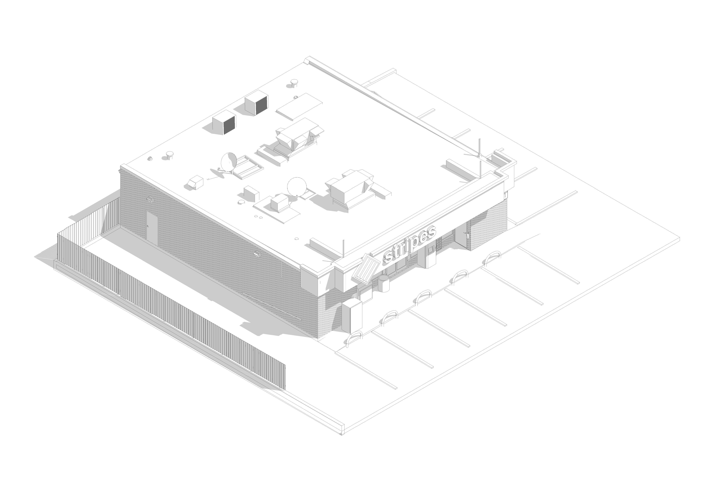
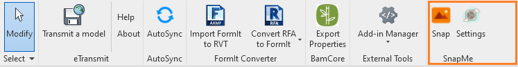


# SnapMe
  

 

***Snap your best BIM models like a pro!***

 
## 📋 Summary

Usually when documenting and showcasing your work as a BIM professional, 
the intent is to bring the best out of your BIM models.

Currently snapping your revit model using the Windows Snipping tool is limited due to its limited resolution.
Exporting images using ExportImage tool in revit is ideal but a tedious process as you have to input 
all the image settings, name the image and select the folder every time you export. 

SnapMe simplifies and enhances the process by separating the settings and the Snap process.
You just input your image settings (resolution & folder directory) once in every live revit session 
and snap as many high quality images as possible! 

This way, new possibilities emerge:
1. You can showcase different models elements while maintaining screen and image resolution settings.
2. You can create overlays of point cloud scan and BIM models in real time.

## 📦 Some feature include:

- Reduce the repetitive process of:
    -  Adjusting export image settings, you only set them once!
    - Choosing image folder directory, you only choose once!
    - Naming images, SnapMe names them for you chronologically!
- Overlay different elements/files/styles without changing the export view.
- Snap high quality images in real time!

## 📦 Future updates will include:

 -  Add all Image settings on the settings command button.
 -  Accommodate predetermined Graphic Styles on 2D & 3D 
 -  Create white clay render styles on 3D views using OpenAi Stable diffusion

 ## ⌨️ Usage Guide

Below is a video illustration on how the tool works. Enjoy!

## ⚙️ Installation
Please follow last release at section [Release](https://github.com/symonkipkemei/SnapMe/releases)

### Version support : From Revit 2020 to Revit 2025.

## 📄 License

This sample is licensed under the terms of the [MIT License](http://opensource.org/licenses/MIT). Please see the [License](License.md) file for full details.

Credit to [icons8.com](https://icons8.com) for the SnapMe icons.

© 2024 Autodesk, Inc.  All rights reserved. All use of this Software is subject to the terms and conditions of the Autodesk End User License Agreement accepted upon installation of this Software and/or packaged with the Software.

## 🍚 Contribute

**SnapMe** is an open-source project. You can make suggestions or track and submit bugs via Github [issues](https://docs.github.com/en/issues/tracking-your-work-with-issues/creating-an-issue). You can submit your own code to the **SnapMe** project via a Github [pull request](https://docs.github.com/en/pull-requests/collaborating-with-pull-requests/proposing-changes-to-your-work-with-pull-requests/about-pull-requests).

Feel free to contribute!
Please refer to the [CONTRIBUTING](CONTRIBUTING.md) for details.

## ✒️ Author

👤 **Symon Kipkemei**

- Github: [symonkipkemei](https://github.com/symonkipkemei)
- Twitter: [@symon_kipkemei](https://twitter.com/symon_kipkemei)
- LinkedIn: [Symon kipkemei](https://www.linkedin.com/in/symon-kipkemei/)

## 🙏 Show your support

I can't guarantee I'll fix all your problems, but I promise you'll never have to tackle them solo. 
I'm your partner in chaos! 😊

Finally, if you've read this far, don't forget to give this repo a ⭐️. 

